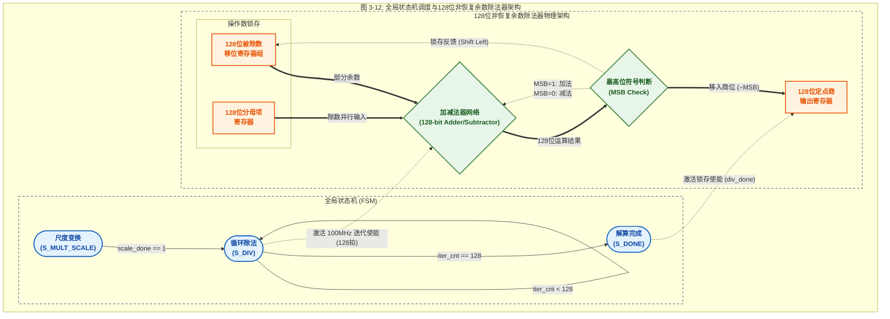

```mermaid
graph TD
    %% ================= 顶刊视觉配色方案 =================
    classDef fsmNode fill:#e3f2fd,stroke:#1565c0,stroke-width:2px,color:#0d47a1,font-weight:bold;
    classDef regNode fill:#fff3e0,stroke:#e65100,stroke-width:2px,color:#e65100,font-weight:bold;
    classDef logicNode fill:#e8f5e9,stroke:#2e7d32,stroke-width:2px,color:#1b5e20,font-weight:bold;
    classDef ctrlEdge color:#1565c0,font-size:12px;
    classDef boundary fill:none,stroke:#78909c,stroke-width:2px,stroke-dasharray: 5 5;

    %% ================= 整体布局 =================
    subgraph System_Top ["图 3-12: 全局状态机调度与128位非恢复余数除法器架构"]
        direction LR

        %% ---------------- 左侧：FSM ----------------
        subgraph FSM_Domain ["全局状态机 (FSM)"]
            direction TB
            S_SCALE(["尺度变换<br>(S_MULT_SCALE)"]):::fsmNode
            S_DIV(["循环除法<br>(S_DIV)"]):::fsmNode
            S_DONE(["解算完成<br>(S_DONE)"]):::fsmNode

            %% FSM 状态跃迁
            S_SCALE -->|"scale_done == 1"| S_DIV
            S_DIV -->|"iter_cnt < 128"| S_DIV
            S_DIV -->|"iter_cnt == 128"| S_DONE
        end

        %% 为了强制 FSM 和 RTL 左右排版，使用不可见连接线
        FSM_Domain ~~~ RTL_Domain

        %% ---------------- 右侧：RTL 数据通路 ----------------
        subgraph RTL_Domain ["128位非恢复余数除法器物理架构"]
            direction TB
            
            %% 寄存器层
            subgraph Reg_Layer ["操作数锁存"]
                direction LR
                DIVIDEND["128位被除数<br>移位寄存器组"]:::regNode
                DIVISOR["128位分母项<br>寄存器"]:::regNode
            end

            %% 组合逻辑层
            ALU{"加减法器网络<br>(128-bit Adder/Subtractor)"}:::logicNode
            
            %% 判决与输出层
            MSB_CHECK{"最高位符号判断<br>(MSB Check)"}:::logicNode
            QUOTIENT["128位定点商<br>输出寄存器"]:::regNode

            %% 核心数据流 (粗线)
            DIVIDEND ==>|"部分余数"| ALU
            DIVISOR ==>|"除数并行输入"| ALU
            ALU ==>|"128位运算结果"| MSB_CHECK
            MSB_CHECK ==>|"移入商位 (~MSB)"| QUOTIENT

            %% 条件反馈环路 (利用节点顺序避免交叉)
            MSB_CHECK -.->|"锁存反馈 (Shift Left)"| DIVIDEND
            MSB_CHECK -.->|"MSB=1: 加法<br>MSB=0: 减法"| ALU
        end
        
    end

    %% ================= 跨域控制信号 =================
    S_DIV -.->|"激活 100MHz 迭代使能 (128拍)"| ALU
    S_DONE -.->|"激活锁存使能 (div_done)"| QUOTIENT

    class FSM_Domain,RTL_Domain boundary;
```
